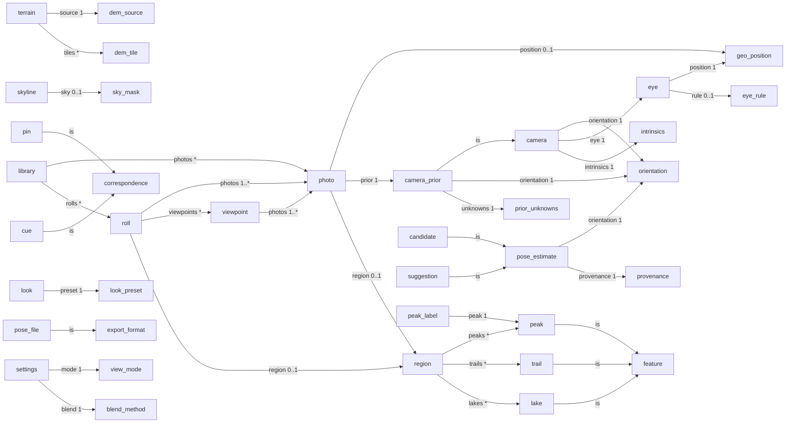

# Rigi ontology

GENERATED from `src/lib/ontology` by `npx tsx scripts/ontology/doc.ts`. Do not edit by hand.
`npx tsx src/lib/ontology/ontology.check.ts` fails while this file is stale. The design rationale is in `reports/ontology-design.md`.

The ontology is Rigi's meta layer. It names every concept once, defines the semantic axes along which values are known (provenance, confidence, units, frames, ids), and maps every existing type and union onto them. The mapping is checked by tsc (crosswalks and realizations) and by `ontology.check.ts` (semantics, ids, storage, docs).

## Contents
1. [Concepts](#concepts) · 2. [Concept graph](#concept-graph) · 3. [Realizations](#realizations) · 4. [Provenance axes](#provenance-axes) · 5. [Methods](#methods) · 6. [Crosswalks](#crosswalks) · 7. [Confidence scales](#confidence-scales) · 8. [Resolution policies](#resolution-policies) · 9. [Units and frames](#units-and-frames) · 10. [Identifiers](#identifiers) · 11. [Storage](#storage) · 12. [Findings](#findings)

## Concepts

### Capture

_what the photographer brought: photos, their metadata, rolls_

| concept | definition | UI words | code words | avoid |
|---|---|---|---|---|
| **Photo** `photo` | One image plus what the device recorded about it (size, time, position, heading, gravity, lens). Bundled, uploaded (local), demo or benchmark. _Note: geo/photo-meta.ts#PhotoMeta is the RAW EXIF record (optional fields, `altitude`, `focal35`); lib/photos.ts#PhotoMeta is the app record. Same name, different concepts: raw-exif vs photo._ | Photo | `PhotoMeta`, `photo`, `meta` |  |
| **Raw EXIF** `raw-exif` | Tags as read from the file before Rigi interprets them (optional everything, magnetic or true heading, 35 mm focal). |  | `ExifTags`, `PhotoMeta (geo)` |  |
| **Prior** `camera-prior` (is camera) | The camera the device's sensors imply before any solving: compass yaw, gravity pitch/roll, EXIF focal, GPS position. A ROLE (fed into solves), not a source. | compass + gravity, phone sensors | `prior`, `priorPose`, `Priors`, `PriorPhoto`, `Unknowns` |  |
| **Unknown priors** `prior-unknowns` | Which priors are placeholders, not measurements: yaw (no compass), gravity (no pitch/roll), focal (no lens data). _Note: tools/bench uses the inverse polarity `focalKnown`._ |  | `Unknowns`, `yawUnknown`, `pitchRollUnknown`, `focalUnknown` |  |
| **Roll** `roll` | Photos of one area shown together (mosaic, map drape, panorama). Derived by clustering photos (15 km link), never stored. | Roll, camera roll, sample trip | `Roll` |  |
| **Viewpoint** `viewpoint` | Photos taken from (almost) the same spot (250 m); their poses stitch into one panorama. _Note: lib/roll/align/viewpoint.ts uses 'viewpoint' for a compass-bias ANCHOR: that is the viewpoint-bias method, not this concept._ | Viewpoint, spot | `Viewpoint`, `VIEWPOINT_RADIUS_M` |  |
| **Library** `library` | Everything on this device: bundled samples, the demo trip, and uploads in IndexedDB. | My library |  |  |

### World

_the terrain and mapped features the photo shows_

| concept | definition | UI words | code words | avoid |
|---|---|---|---|---|
| **Region** `region` | A ~20 km neighbourhood of mapped features (peaks, trails, water names, lakes) around one or more photos. |  | `RegionData`, `LocalRegion` |  |
| **Mapped feature** `feature` | Something named on the map that can appear in a photo. |  |  |  |
| **Peak** `peak` (is feature) | A named summit (OSM natural=peak) with elevation and, where known, prominence. _Note: `ele` is `number\|undefined` in Peak/PeakInput but `number\|null` in RegionPeak/PoolPeak; RegionPeak has no id (keyed by name)._ | Peak, summit | `Peak`, `RegionPeak`, `PoolPeak`, `PeakInput`, `PeakPoint` |  |
| **Lake** `lake` (is feature) | A water body whose level is a horizontal reference (shore cues, eye floor). |  | `LakeGeo`, `SceneLake`, `LakeLevel` |  |
| **Trail** `trail` (is feature) | A mapped path with an SAC difficulty class, drawn on the terrain. |  | `RegionTrail` |  |
| **Terrain** `terrain` | The DEM surface: heights in metres MSL, sampled from tiles at distance-dependent zoom. |  | `Terrain`, `TerrainSampler`, `HeightFn` |  |
| **DEM source** `dem-source` | A tiled elevation dataset (Mapterhorn 512 px, Terrarium 256 px) with zoom levels by distance. |  | `DemSource`, `TerrainLevel` |  |
| **DEM tile** `dem-tile` | One z/x/y height raster (row 0 = north), possibly an ancestor stand-in. |  | `TileKey`, `DemRaster` |  |
| **3D Tiles source** `tiles3d-source` | Photogrammetry / building tiles drawn in Step Inside (swisstopo MSL, Google ellipsoidal; Google is display-only). |  | `Tiles3DSource`, `Tiles3DSourceId` |  |

### Camera

_where the camera was and how it pointed_

| concept | definition | UI words | code words | avoid |
|---|---|---|---|---|
| **Camera** `camera` | Everything needed to project the world into the photo: orientation, eye position and intrinsics, on an image size. _Note: Canonical decomposition is CameraX {pose, eye, aspect, intr}. geo Camera is the solvers' pixel form (f in px, axes vectors); bridge with poseToCamera/cameraToPose._ |  | `CameraX`, `Camera`, `CameraModel`, `GeoState` |  |
| **Pose** `orientation` | Where the camera pointed: yaw (true heading, clockwise from north), pitch (up +), roll (right side down +), and vertical field of view. Degrees. Carries NO position. | Pose, alignment | `Pose`, `yaw`, `pitch`, `roll`, `vfov` | pose (meaning position+orientation) |
| **Intrinsics** `intrinsics` | The lens model beyond vfov: focal scale, k1 radial distortion, principal point (normalised). Default: square pixels, centred, no distortion. |  | `Intrinsics`, `f35`, `focal`, `fScale` |  |
| **Eye** `eye` | The camera centre: lat/lon plus height (MSL). Usually GPS horizontally; vertically the eye rule unless solved. | camera position | `eye`, `eyeAlt`, `EnuFrame`, `Eye` | eyeOffset (pose6dof: it is absolute, not an offset) |
| **Position** `geo-position` | A WGS84 point with an explicit height datum. |  | `LatLon`, `GeoPoint` |  |
| **Eye rule** `eye-rule` | How eye height is set without a solve: max(GPS alt, DEM + 1.6 m); with no altitude the engine uses DEM + 1.8 m while geo/pipeline uses DEM + 1.6 m. _Note: Known drift: engine.ts:393 and roll ridgelines.worker.ts use 1.8 m when alt is null; geo/pipeline.ts:45 uses 1.6 m._ |  | `EYE_ABOVE_GROUND`, `eyeAlt` |  |

### Evidence

_what is observed in the photo and matched to the world_

| concept | definition | UI words | code words | avoid |
|---|---|---|---|---|
| **Horizon** `horizon` | The MODELLED skyline: per-azimuth elevation of the DEM's highest visible ridge from the eye. |  | `HorizonProfile`, `FastHorizonProfile`, `EyeHorizon`, `LayeredHorizon` | skyline (for the modelled curve) |
| **Skyline** `skyline` | The OBSERVED sky/terrain boundary in the photo: per-column row and weight. |  | `SkylineObservation`, `SkylineRows`, `SkylineInput`, `SkylineSample` |  |
| **Sky mask** `sky-mask` | Per-pixel P(sky)·255, row 0 = top, from the segmentation model or a colour fallback. |  | `SkyMask`, `SkyMaskLike` |  |
| **Foreground mask** `foreground-mask` | Per-pixel person/foreground mask (255 = person), row 0 = top: protected from terrain blending and excluded from skyline evidence. _Note: renderer.ts FgMask is a generic 8-bit mask shape reused for foreground, P(sky) and the occluder, not this concept._ |  | `ForegroundMask`, `protectPeople` |  |
| **Correspondence** `correspondence` | An image point tied to the world: a 3D point, a direction, a level or an azimuth. The input to pin solves and MAP. |  | `Correspondence`, `PointCorr`, `DirCorr`, `LevelCorr`, `AzimuthCorr`, `Corr2D3D` |  |
| **Pin** `pin` (is correspondence) | A user's tap tying a named peak to an image point (1 pin: yaw/pitch; 2: + roll; 3: + fov). _Note: session state only; the solved pose is saved, the pins are not._ | Pin | `Pin`, `TapPin` | pin (meaning a map position pin: call that map-pin / place) |
| **Cue** `cue` (is correspondence) | An automatically found or curated correspondence of one evidence family (point, edge, level, shore), with residual and confidence. |  | `Cue`, `InteriorPin`, `MatchedCue`, `JointCue` |  |

### Estimate

_solving, judging and choosing camera estimates_

| concept | definition | UI words | code words | avoid |
|---|---|---|---|---|
| **Pose estimate** `pose-estimate` | An orientation (and possibly eye) plus its provenance: who/what produced it, from which evidence, and how it was judged. |  | `SolvedPose`, `AppAlign`, `UnknownPoseOutcome`, `SecondOpinion`, `DemoPose` |  |
| **Candidate** `candidate` (is pose-estimate) | One of several alternative pose estimates offered for choice (picker, cascade seeds, autoAlign alternatives). |  | `Candidate`, `alternatives`, `candidates`, `RefineMode` |  |
| **Solve result** `solve-result` | A solver's full output: the estimate plus residuals, inliers, uncertainty and diagnostics. _Note: Two exports are both named SolveResult (geo/solve.ts, pose6dof/types.ts)._ |  | `SolveResult`, `AlignResult`, `RefineResult`, `MapResult`, `MatchResult`, `UnknownPoseResult` |  |
| **Provenance** `provenance` | How a value is known, on orthogonal axes: agent, method, evidence, role, status, outcome, corroboration, confidence. |  | `PoseSource`, `AlignState`, `positionSource`, `source`, `method` |  |
| **Confidence** `confidence` | A producer's score on its own scale, read as a comparable level (high/medium/low/unknown). |  | `confidence`, `Confidence`, `PoseConfidence`, `confidenceLevel` |  |
| **Ground truth** `ground-truth` | Hand-fitted poses for bundled photos (data/ground-truth.json, quality good/approx/none). Shown as 'fitted'; an oracle in evaluation. | fitted | `GT`, `GtEntry`, `ground-truth` |  |
| **Suggestion** `suggestion` (is pose-estimate) | A propagated pose offered for a person to accept or dismiss; never HIGH, never an anchor. |  | `StoredSuggestion`, `Proposal` |  |

### Presentation

_how a solved photo is drawn: modes, looks, labels, layers_

| concept | definition | UI words | code words | avoid |
|---|---|---|---|---|
| **View mode** `view-mode` | How terrain and photo combine: Overlay (lines on the photo), Blend (terrain replaces parts of it), In map (3D world). | Overlay, Blend, In map | `ViewMode`, `overlay`, `replace`, `world`, `StyleMode`, `DeckStyleMode` | replace (UI: Blend); world (UI: In map) |
| **Blend method** `blend-method` | How Blend chooses where terrain shows: lens, swipe, distance range, brush. | Lens, Swipe, Distance, Brush | `BlendMethod`, `range` |  |
| **Look** `look` | The whole visual style of a view (terrain lighting, overlay lines, bands, labels): a preset plus overrides. | Look, Style | `ViewStyle`, `StyleState`, `PresetId` |  |
| **Look preset** `look-preset` | A named patch over CLASSIC (classic, minimal, topo-map, night, …). |  | `PresetId`, `PRESETS` |  |
| **Label** `peak-label` | A peak projected into the photo, ranked, occlusion-tested and laid out. _Note: Three exports named PeakLabel (settings.ts, deck/scene.ts, geo/peaks.ts)._ | labels | `PeakLabel`, `LabelCandidate`, `PlacedLabel` |  |
| **Reveal** `reveal` | The overlay's bloom-in animation on load (presets, duration, glow). |  | `RevealConfig`, `RevealPresetId` |  |
| **Step Inside** `step-inside` | The near field rebuilt in 3D (Gaussian splats on the DEM) with photo / orbit / fly / top-down cameras. | Step Inside, Photo, Orbit, Fly, Top-down | `NearFieldScene`, `StepMode`, `GaussianCloud` |  |

### Interchange

_files and formats that leave the app_

| concept | definition | UI words | code words | avoid |
|---|---|---|---|---|
| **Export format** `export-format` | A file Rigi writes for a solved photo (annotated PNG, KMZ, GeoJSON, pose JSON, COLMAP, XMP, splats). |  | `ExportKind`, `ExportFormat`, `SplatExportKind` |  |
| **Pose file** `pose-file` (is export-format) | Self-describing pose JSON (schema summit-lens/pose v1): position with both datums, orientation, K, R\|t. |  |  |  |

### System

_renderers, flags, settings, storage_

| concept | definition | UI words | code words | avoid |
|---|---|---|---|---|
| **Renderer** `renderer` | An engine that draws terrain behind/over the photo: deck.gl (default) or three.js; WebGPU deck in progress. |  | `Renderer`, `PhotoEngine`, `DeckEngine` |  |
| **Flag** `flag` | A typed page-level switch (?name=value), read only through lib/flags. |  | `FLAG_SCHEMA`, `Flags`, `FlagName` |  |
| **View settings** `settings` | The workspace's per-view knobs (mode, blend method, overlay/replace/world layer choice, opacity, toggles). |  | `Settings` |  |

## Concept graph

## Realizations

These are the TypeScript types that realize each concept. The first is canonical. `checks/realizations.ts` proves that each one exists.

| concept | types |
|---|---|
| `photo` | `lib/photos.ts#PhotoMeta`, `lib/upload/exif.ts#LocalPhotoMeta`, `lib/upload/store.ts#PhotoRecord`, `lib/geo/photo-meta.ts#PhotoMeta` |
| `raw-exif` | `lib/upload/exif.ts#ExifTags`, `lib/geo/photo-meta.ts#PhotoMeta` |
| `camera-prior` | `lib/pose6dof/types.ts#Priors`, `lib/geocam/priors/photo-priors.ts#PriorPhoto` |
| `prior-unknowns` | `lib/integration/unknown-pose.ts#Unknowns`, `lib/upload/exif.ts#LocalPhotoExtras` |
| `roll` | `lib/roll/types.ts#Roll`, `lib/roll/types.ts#RollPhoto` |
| `viewpoint` | `lib/roll/types.ts#Viewpoint` |
| `library` | `lib/upload/index.ts#LocalPhotoSummary` |
| `region` | `lib/photos.ts#RegionData`, `lib/upload/region.ts#LocalRegion` |
| `feature` | `lib/overpass.ts#OsmElement` |
| `peak` | `lib/geo/peaks.ts#Peak`, `lib/photos.ts#RegionPeak`, `lib/picker/candidates.ts#PoolPeak`, `lib/export/geojson.ts#PeakInput` |
| `lake` | `lib/geocam/lakes/compact.ts#LakeGeo`, `lib/geocam/lakes/levels.ts#LakeLevel` |
| `trail` | `lib/photos.ts#RegionTrail` |
| `terrain` | `lib/terrain.ts#TerrainTile`, `lib/geo/terrain.ts#TerrainSampler` |
| `dem-source` | `lib/dem/sources.ts#DemSource` |
| `dem-tile` | `lib/dem/tiles.ts#TileKey`, `lib/dem/load.ts#DemRaster` |
| `tiles3d-source` | `lib/tiles3d/config.ts#Tiles3DSource` |
| `camera` | `lib/concord/core/types.ts#CameraX`, `lib/geo/camera.ts#Camera`, `lib/export/camera.ts#CameraModel` |
| `orientation` | `lib/camera/index.ts#Pose`, `lib/geo/camera.ts#CameraParams` |
| `intrinsics` | `lib/concord/core/types.ts#Intrinsics` |
| `eye` | `lib/geodesy.ts#EnuFrame` |
| `geo-position` | `lib/geodesy.ts#LatLon`, `lib/ontology/core/geometry.ts#GeoPoint` |
| `eye-rule` | `lib/concord/priors/altitude.ts#EyePrior` |
| `horizon` | `lib/geo/horizon.ts#HorizonProfile`, `lib/pose6dof/eye.ts#EyeHorizon` |
| `skyline` | `lib/geo/skyline.ts#SkylineObservation`, `lib/pose6dof/eye.ts#SkylineSample` |
| `sky-mask` | `lib/sky/index.ts#SkyMask` |
| `foreground-mask` | `lib/segment.ts#ForegroundMask` |
| `correspondence` | `lib/pose6dof/types.ts#Correspondence`, `lib/geocam/map/factors.ts#Corr2D3D`, `lib/geo/control-points.ts#ControlPoint` |
| `pin` | `lib/align.ts#Pin` |
| `cue` | `lib/concord/core/types.ts#Cue`, `lib/concord/core/types.ts#InteriorPin` |
| `pose-estimate` | `lib/roll/types.ts#SolvedPose`, `lib/integration/second-opinion.ts#AppAlign`, `lib/integration/unknown-pose.ts#UnknownPoseOutcome`, `lib/integration/second-opinion.ts#SecondOpinion` |
| `candidate` | `lib/picker/candidates.ts#Candidate`, `lib/refine/index.ts#RefineMode` |
| `solve-result` | `lib/align.ts#AlignResult`, `lib/geo/solve.ts#SolveResult`, `lib/pose6dof/types.ts#SolveResult`, `lib/refine/index.ts#RefineResult`, `lib/geocam/core/types.ts#MapResult`, `lib/matcher-client.ts#MatchResult`, `lib/integration/unknown-pose.ts#UnknownPoseResult` |
| `provenance` | `lib/ontology/core/provenance.ts#Provenance`, `lib/roll/types.ts#PoseSource` |
| `confidence` | `lib/ontology/core/confidence.ts#Confidence`, `lib/refine/confidence.ts#Confidence`, `lib/concord/app/confidence.ts#PoseConfidence` |
| `ground-truth` | `lib/roll/roll.ts#GtEntry` |
| `suggestion` | `lib/roll/propagate/store.ts#StoredSuggestion` |
| `view-mode` | `lib/settings.ts#ViewMode`, `lib/style/three-apply.ts#StyleMode` |
| `blend-method` | `lib/settings.ts#BlendMethod` |
| `look` | `lib/style/types.ts#ViewStyle`, `lib/style/types.ts#StyleState` |
| `look-preset` | `lib/style/types.ts#PresetId` |
| `peak-label` | `lib/settings.ts#PeakLabel`, `lib/geo/peaks.ts#PeakLabel`, `lib/look/labels/layout.ts#LabelCandidate` |
| `reveal` | `lib/reveal/config.ts#RevealConfig` |
| `step-inside` | `lib/nearfield/types.ts#NearFieldScene`, `lib/nearfield/types.ts#GaussianCloud` |
| `export-format` | `lib/export/engine-export.ts#ExportFormat`, `lib/export/splat.ts#SplatExportFormat` |
| `pose-file` | `lib/export/pose-json.ts#PoseJson` |
| `renderer` | `lib/renderer.ts#Renderer` |
| `flag` | `lib/flags/index.ts#Flags` |
| `settings` | `lib/settings.ts#Settings` |

## Provenance axes

A value's provenance is recorded on independent axes. It is never folded into a single `source` string. `Provenance` is a sidecar that sits next to the value and does not wrap it.

### Agent: who produced it

| term | meaning |
|---|---|
| `user` | a person, in this app (pin, drag, save, accept, map pin) |
| `sensor` | the capturing device: GPS, compass, gravity, clock, lens/EXIF |
| `solver` | a Rigi algorithm fitting evidence (align, cascade, matcher, propagate, …) |
| `reference` | curated external truth: ground-truth fits, OSM, swisstopo, the DEM, tables |
| `model` | a learned model (sky segmentation, depth, splats, generation) |
| `rule` | a fixed default or deterministic rule (eye = DEM + 1.6 m, f35 = 26 mm, interpolation) |

### Role: how it is used

| term | meaning |
|---|---|
| `prior` | a starting belief fed INTO a solve (EXIF compass/gravity/lens, GPS position) |
| `observation` | a measurement a solve fits TO (skyline, pins, cues) |
| `estimate` | the OUTPUT of a solve or a user's choice |
| `oracle` | truth withheld from the system and used only to score it (ground truth in evaluation) |

### Status: where it stands in being judged

| term | meaning |
|---|---|
| `candidate` | produced, not (yet) judged; may be shown as a best guess |
| `pending` | a judgement is running (second opinion, matcher, user review) |
| `accepted` | passed an automatic accept rule |
| `endorsed` | a person set or confirmed it (save, pin, drag, accept suggestion) |
| `rejected` | failed an accept rule or was dismissed by a person |
| `failed` | the producing process errored or found nothing |
| `superseded` | replaced by a better estimate; kept for history |

### Outcome: what a verification did

| term | meaning |
|---|---|
| `kept` | the estimate stands |
| `replaced` | a different estimate replaced it |
| `timeout` | the check ran out of time |
| `unavailable` | the checker could not run (service down, busy, unsupported) |

### Evidence: what it rests on (the first 13 are exactly geocam `CueFamily`)

| term | meaning |
|---|---|
| `gps` | GNSS horizontal fix |
| `alt` | GNSS / barometric altitude |
| `ground` | standing on the DEM surface |
| `lakeFloor` | at or above a nearby lake's level |
| `gravity` | accelerometer gravity vector (pitch, roll) |
| `compass` | magnetometer heading |
| `focal` | lens focal length (EXIF f35 / lens table) |
| `skyline` | photo skyline vs DEM horizon |
| `point` | a 2D↔3D point (pin, summit, control point) |
| `edge` | image edge vs terrain occlusion edge |
| `junction` | edge junction vs terrain junction |
| `level` | a horizontal level (lake shore, waterline) at known height |
| `shore` | lake shore outline |
| `time` | capture time (track interpolation, sun position) |
| `appearance` | rendered-vs-photo appearance matching (matcher) |
| `rotation` | relative rotation from a neighbouring photo (propagation) |
| `pixels` | raw image pixels (segmentation, depth) |
| `terrain` | the DEM itself |
| `map` | map data (OSM, swisstopo vectors) |

Trusted auto (`isTrustedAuto`) means: an automatic agent, status `accepted`, and either corroborated or at `high` level. A person's own pose is trusted by definition, but it is never counted as auto.

## Methods

| method | agent | what | evidence | estimates | module |
|---|---|---|---|---|---|
| `exif-prior` | sensor | EXIF compass + gravity + lens | compass, gravity, focal | orientation, focal | lib/roll/roll.ts priorPose, lib/upload/exif.ts |
| `gps-fix` | sensor | GPS position | gps, alt | position, eye-height | lib/upload/exif.ts |
| `exif-time` | sensor | EXIF capture time | time | time | lib/upload/exif.ts |
| `skyline-align` | solver | Auto-align to skyline | skyline, compass, gravity, focal | orientation | lib/align.ts autoAlign |
| `near-compass` | solver | Skyline fit near the compass heading | skyline, compass | orientation | lib/integration/second-opinion.ts choosePreview |
| `cascade` | solver | Unknown-pose cascade (solve, then refine on reject) | skyline, gravity, focal, gps, alt | orientation, focal | lib/integration/unknown-pose.ts |
| `cascade-solve` | solver | Unknown-pose cascade: global solve | skyline, gravity, focal | orientation, focal | lib/integration/unknown-pose.ts, lib/geo/pipeline.ts |
| `cascade-refine` | solver | Unknown-pose cascade: refine | skyline, gps, alt | orientation, focal, eye-height | lib/refine |
| `matcher` | solver | Render-and-match service | appearance, skyline | orientation | lib/matcher-client.ts, tools/matcher |
| `propagate` | solver | Propagate from a neighbouring photo | rotation | orientation | lib/roll/propagate |
| `eye-refine` | solver | Eye refinement on the skyline | skyline, ground | position, eye-height | lib/pose6dof/eye.ts |
| `geo-map` | solver | Geometry-first MAP camera | gps, alt, ground, lakeFloor, gravity, compass, focal, skyline, point, level, shore | orientation, position, focal | lib/geocam |
| `concord` | solver | Whole-image concordance | point, edge, level, shore | orientation, eye-height | lib/concord |
| `pin-solve` | user | Solve from pinned peaks | point | orientation, focal | lib/align.ts solvePins |
| `picker-tap` | user | Pick a candidate / tap a peak | point | orientation | lib/picker |
| `manual-drag` | user | Drag the overlay by hand |  | orientation | components/PhotoWorkspace.tsx |
| `map-pin` | user | Place the photo on the map |  | position | lib/upload, lib/roll/import |
| `ground-truth-fit` | reference | Hand-fitted ground truth | point | orientation, focal, eye-height | data/ground-truth.json |
| `osm-data` | reference | OpenStreetMap features | map | geometry | lib/upload/region.ts, lib/osm |
| `swisstopo-data` | reference | swisstopo data | map, terrain | geometry | lib/tiles3d, lib/concord |
| `dem-sample` | reference | DEM height sample | terrain | eye-height, geometry | lib/dem |
| `level-table` | reference | Lake level table | map | eye-height | lib/geocam/lakes/levels.ts |
| `eye-rule` | rule | Eye = max(GPS alt, DEM + 1.6 m) (DEM + 1.8 m without altitude in the engine) | ground, alt | eye-height | lib/engine.ts, lib/geo/pipeline.ts |
| `alt-contour` | rule | Eye on the GPS-altitude iso-band | gps, alt, ground | position, eye-height | lib/concord/priors/altitude.ts |
| `viewpoint-bias` | rule | Shift a prior by the median yaw offset of the viewpoint's solved anchors | compass, rotation | orientation | lib/roll/align/viewpoint.ts |
| `track-interpolate` | rule | Interpolate position along the roll's GPS track | time, gps | position | lib/roll/import/interpolate.ts |
| `track-nearest` | rule | Nearest GPS'd photo in time | time, gps | position | lib/roll/import/interpolate.ts |
| `default` | rule | Fixed default (f35 = 26 mm, level horizon, …) |  | focal, orientation | lib/upload/exif.ts |
| `sky-fallback` | rule | Colour-based sky fallback | pixels | sky | lib/sky |
| `sky-model` | model | Sky segmentation network | pixels | sky | lib/sky |
| `depth-model` | model | Monocular depth (MoGe-2 / DA3) | pixels | depth | lib/nearfield |
| `splat-model` | model | Gaussian splat lift (SHARP / lift) | pixels | geometry | lib/nearfield |
| `generative-model` | model | Novel-view generation | pixels | geometry | lib/nearfield/generate |

## Crosswalks

Each table maps every member of an app union onto the canonical axes, and tsc enforces that the mapping is exhaustive (`satisfies Record<Union, …>`).

### PoseSource

`lib/roll/types.ts`

| value | provenance | UI |
|---|---|---|
| `saved` | status=endorsed | saved |
| `ground-truth` | agent=reference · method=ground-truth-fit · status=accepted | fitted |
| `solved` | agent=solver · method=cascade · status=accepted | solved |
| `prior` | agent=sensor · method=exif-prior · role=prior · status=candidate | prior |

### SolvedPose.method

`lib/roll (align, propagate)`

| value | provenance | UI |
|---|---|---|
| `cascade` | agent=solver · method=cascade · status=accepted |  |
| `propagated-suggestion` | agent=user · method=propagate · status=endorsed · level=low |  |

### AlignState

`components/PhotoWorkspace.tsx`

| value | provenance | UI |
|---|---|---|
| `auto` | method=skyline-align · status=accepted | Auto-aligned |
| `near-compass` | method=near-compass · status=candidate | Near compass |
| `prior` | agent=sensor · method=exif-prior · role=prior · status=candidate | Phone sensors |
| `saved` | status=endorsed | Saved |
| `accepted` | agent=solver · status=accepted · level=high | Accepted |
| `unverified` | status=candidate · corroborated=false | Unverified |
| `manual` | agent=user · status=endorsed | Manual |
| `pinned` | agent=user · method=pin-solve · status=endorsed | Pinned |

### SecondOpinionVerdict

`lib/integration/second-opinion.ts`

| value | provenance | UI |
|---|---|---|
| `verified` | outcome=kept · corroborated=true |  |
| `refined` | method=cascade · status=accepted · outcome=replaced · level=high |  |
| `kept` | outcome=kept |  |
| `unverified` | outcome=kept · corroborated=false |  |
| `matched` | method=matcher · status=accepted · outcome=replaced · level=high |  |
| `timeout` | outcome=timeout |  |

### SecondOpinion.matcher

`lib/integration/second-opinion.ts`

| value | provenance | UI |
|---|---|---|
| `unavailable` | method=matcher · outcome=unavailable |  |
| `busy` | method=matcher · status=pending |  |
| `no-result` | method=matcher · status=failed |  |
| `low` | method=matcher · status=rejected |  |
| `high` | method=matcher · status=accepted · level=high |  |

### UnknownPoseOutcome.state

`lib/integration/unknown-pose.ts`

| value | provenance | UI |
|---|---|---|
| `accepted` | status=accepted · level=high |  |
| `unverified` | status=candidate · corroborated=false |  |

### UnknownPoseOutcome.source

`lib/integration/unknown-pose.ts`

| value | provenance | UI |
|---|---|---|
| `cascade` | agent=solver · method=cascade |  |
| `matcher` | agent=solver · method=matcher |  |
| `none` | agent=rule · method=default · role=prior |  |

### CandidateSource

`lib/picker/candidates.ts`

| value | provenance | UI |
|---|---|---|
| `shown` | status=candidate |  |
| `align` | agent=solver · method=skyline-align · status=candidate |  |
| `cascade` | agent=solver · method=cascade · status=candidate |  |
| `tap` | agent=user · method=picker-tap · status=candidate |  |

### AlignStatus (roll)

`lib/roll/align/align.ts`

| value | provenance | UI |
|---|---|---|
| `accepted` | agent=solver · method=cascade · status=accepted |  |
| `needs-review` | agent=solver · method=cascade · status=candidate |  |
| `failed` | agent=solver · method=cascade · status=failed |  |

### RowStatus (propagate)

`lib/roll/propagate/run.ts`

| value | provenance | UI |
|---|---|---|
| `skipped` | method=propagate · status=failed |  |
| `queued` | method=propagate · status=pending |  |
| `running` | method=propagate · status=pending |  |
| `error` | method=propagate · status=failed |  |
| `rejected` | method=propagate · status=rejected |  |
| `suggested` | method=propagate · status=candidate |  |

### StoredSuggestion.status

`lib/roll/propagate/store.ts`

| value | provenance | UI |
|---|---|---|
| `pending` | method=propagate · status=candidate |  |
| `accepted` | agent=user · method=propagate · status=endorsed |  |
| `dismissed` | agent=user · method=propagate · status=rejected |  |

### positionSource (upload)

`lib/upload/exif.ts`

| value | provenance | UI |
|---|---|---|
| `exif` | agent=sensor · method=gps-fix · role=prior |  |
| `pin` | role=prior |  |

### positionSource() (matcher)

`lib/integration/unknown-pose.ts`

| value | provenance | UI |
|---|---|---|
| `exif-gps` | agent=sensor · method=gps-fix · role=prior |  |
| `manual` | role=prior |  |

### PositionProvenance.method

`lib/roll/import/provenance.ts`

| value | provenance | UI |
|---|---|---|
| `interpolated` | agent=rule · method=track-interpolate |  |
| `nearest` | agent=rule · method=track-nearest |  |
| `pin` | agent=user · method=map-pin · status=endorsed |  |

### Placement.kind

`lib/roll/import/index.ts`

| value | provenance | UI |
|---|---|---|
| `gps` | agent=sensor · method=gps-fix · role=prior |  |
| `estimate` | agent=rule · method=track-interpolate · status=candidate |  |
| `pin` | agent=user · method=map-pin · status=endorsed |  |
| `none` | status=failed |  |

### EyePrior.source

`lib/concord/priors/altitude.ts`

| value | provenance | UI |
|---|---|---|
| `gps+alt-contour` | agent=rule · method=alt-contour · role=prior |  |
| `gps+dem-floor` | agent=rule · method=eye-rule · role=prior |  |
| `pin` | agent=rule · method=eye-rule · role=prior |  |

### timeSource

`lib/upload/exif.ts`

| value | provenance | UI |
|---|---|---|
| `gps` | agent=sensor · method=exif-time |  |
| `exif` | agent=sensor · method=exif-time |  |
| `exif-local` | agent=sensor · method=exif-time · level=low |  |
| `file` | agent=rule · method=default · level=low |  |

### LakeLevel.source

`lib/geocam/lakes/levels.ts`

| value | provenance | UI |
|---|---|---|
| `osm` | agent=reference · method=osm-data |  |
| `table` | agent=reference · method=level-table |  |
| `dem` | agent=reference · method=dem-sample · level=low |  |

### InteriorPin.source

`lib/concord/core/types.ts`

| value | provenance | UI |
|---|---|---|
| `osm` | agent=reference · method=osm-data |  |
| `swisstopo` | agent=reference · method=swisstopo-data |  |
| `manual` | agent=user · status=endorsed |  |

### nearfield Provenance

`lib/nearfield/types.ts`

| value | provenance | UI |
|---|---|---|
| `observed` | agent=model · method=depth-model · role=observation |  |
| `reconstructed` | agent=model · method=splat-model |  |
| `dem` | agent=reference · method=dem-sample |  |
| `generated` | agent=model · method=generative-model · level=low |  |

### SkyMask.source

`lib/sky/index.ts`

| value | provenance | UI |
|---|---|---|
| `model` | agent=model · method=sky-model |  |
| `fallback` | agent=rule · method=sky-fallback · level=low |  |

### View mode and blend method (UI words)

| code | UI | hint |
|---|---|---|
| `overlay` | Overlay | terrain lines and labels drawn on the photo |
| `replace` | Blend | terrain replaces parts of the photo |
| `world` | In map | the photo placed in the 3D world |

| code | UI |
|---|---|
| `lens` | Lens |
| `swipe` | Swipe |
| `range` | Distance |
| `brush` | Brush |

### Export kinds

| kind | concept | versioned |
|---|---|---|
| `png` | `export-format` | no |
| `kmz` | `export-format` | no |
| `geojson` | `export-format` | no |
| `pose` | `pose-file` | yes |
| `colmap` | `export-format` | no |
| `xmp` | `export-format` | yes |
| `splat-ply` | `export-format` | no |
| `splat-v1` | `export-format` | yes |

## Confidence scales

Scores are only comparable within one scale. Levels can be compared across scales: `high` means at or above the producer's own accept threshold.

| scale | label | calibrated | high ≥ | medium ≥ | accept rule | module |
|---|---|---|---|---|---|---|
| `skyline-align` | autoAlign confidence | no | never | 0.2 | > 0.2 shows it as the auto pose (second-opinion.ts choosePreview); never HIGH alone (43 % wild precision) | lib/align.ts |
| `cascade` | unknown-pose cascade | no | 0.5 | 0.5 | accepted && !ambiguous && !weak360; the bar rises to 0.75 when focal or yaw is unknown (unknown-pose.worker.ts) | lib/integration/unknown-pose.ts |
| `refine` | refine score (product of six ramps) | no | 0.5 | 0.5 | score ≥ 0.5 && !hardFail (refine/confidence.ts) | lib/refine/confidence.ts |
| `matcher` | matcher level (0.9 = HIGH, 0.2 = LOW) | no | 0.9 | 0.9 | HIGH && (position trusted \|\| cascade within MATCH_AGREE_DEG) (matcher-client.ts matchAccepted) | lib/matcher-client.ts |
| `concord` | concordance display confidence | no | 0.5 | 0.5 | fail closed below 0.5 (concord/app MIN_CONFIDENCE) | lib/concord/app/confidence.ts |
| `roll` | roll solved-pose confidence (the cascade's) | no | 0.5 | 0.5 | only accepted poses are stored; propagated suggestions store 0 (never HIGH) | lib/roll/align/align.ts |

## Resolution policies

### `rollDisplay`: Roll display

the pose drawn for each photo in /roll and the panorama. Implemented by `lib/roll/roll.ts resolvePose`.

1. endorsed by a person (saved, pinned, dragged, accepted suggestion)
2. hand-fitted ground truth
3. accepted by a solver
4. device prior (EXIF compass + gravity + lens)

### `rollStateless`: Roll, ignoring this device's state

a pose independent of saved/solved localStorage (lab views; ground truth is still shown). Implemented by `lib/roll/roll.ts resolvePose({ignoreStored}) (routes/lab.generate.tsx)`.

1. hand-fitted ground truth
2. device prior (EXIF compass + gravity + lens)

### `evaluation`: Evaluation

scoring: ground truth is an oracle and is never a candidate; only what the system itself produces competes. Implemented by `tools/bench harness + scripts/eval-app.mjs (outside resolvePose; resolvePose's ignoreGroundTruth option has no caller)`.

1. accepted by a solver
2. device prior (EXIF compass + gravity + lens)

### `workspace`: Photo workspace

the pose shown on /photo/$id: a person's choice, else a verified/accepted solve, else the best guess. Implemented by `components/PhotoWorkspace.tsx (AlignState transitions)`.

1. endorsed by a person (saved, pinned, dragged, accepted suggestion)
2. accepted and corroborated (verified)
3. accepted by a solver
4. best-guess candidate (near-compass, unverified)
5. device prior (EXIF compass + gravity + lens)

## Units and frames

Quantities are soft-branded (`Deg`, `Rad`, `Metres`, `Height<Datum>`, `Px<Basis>`, `Norm`, `Prob`, `Millis`, `Seconds`, `IsoTime`). A plain number is assignable to any of them, but two different units are never assignable to each other.

Height datums are `msl` (DEM, OSM, GPS), `ellipsoid` (ECEF, Google tiles) and `ground` (above the DEM). The two ENU frames are distinct: `enu-engine` has its origin at (lat, lon, h=0) and z is MSL; `enu-eye` has its origin at the eye.

| pixel basis | measured on | px |
|---|---|---|
| `norm` | none | 1 |
| `work` | own | own size |
| `long1600` | long | 1600 |
| `wide1600` | width | 1600 |
| `wide1000` | width | 1000 |

## Identifiers

A reference is `Ref<C> = {concept, id}`, and its string form is the URN `rigi:<concept>/<id>`. Schemes are tried most-specific first.

| concept | kind | pattern | example | stable | minted by |
|---|---|---|---|---|---|
| photo | bundled | `^IMG_\d+$` | `IMG_6971` | yes | scripts/ingest.mjs |
| photo | demo | `^demo-\d+$` | `demo-03` | yes | scripts/demo/unpack.mjs |
| photo | local | `^local-(?!region-\|roll-)[0-9a-f]{10}$` | `local-3fa9c1d2e4` | yes | upload/index.ts idForFile (SHA-256 prefix, or f+9 hex FNV on insecure origins) (content hash: the same file is the same photo on every device) |
| photo | bench | `^wc_\d+$` | `wc_0042` | yes | tools/bench (wild benchmark) |
| region | bundled | `^region-\d+$` | `region-3` | yes | scripts/ingest.mjs |
| region | local-empty | `^local-region-empty-.+$` | `local-region-empty-local-3fa9c1d2e4` | yes | upload/index.ts (photo without a position) |
| region | local | `^local-region--?\d+\.\d{2}_-?\d+\.\d{2}$` | `local-region-46.55_7.95` | yes | upload/region.ts (0.05° grid cell) |
| region | demo | `^demo-region$` | `demo-region` | yes | public/demo/manifest.json |
| roll | demo | `^demo$` | `demo` | yes | demo/index.ts DEMO_ROLL_ID |
| roll | local-legacy | `^local-roll-\d{1,4}$` | `local-roll-2` | no | roll/roll.ts (old cluster index ids, still resolved) |
| roll | local | `^local-roll-[0-9a-f]{10}$` | `local-roll-3fa9c1d2e4` | no | roll/roll.ts uploadRollId (earliest photo's hash) (changes when an earlier photo joins the cluster) |
| roll | bundled | `^region-\d+$` | `region-3` | yes | roll/roll.ts (one roll per bundled region) (a bundled roll's id IS its region id) |
| roll | preview | `^preview-\d+$` | `preview-0` | no | routes/roll.import.tsx (unsaved import preview) |
| peak | osm | `^node\/\d+$` | `node/123456` | yes | OpenStreetMap |
| lake | osm | `^(way\|relation)\/\d+$` | `way/4242` | yes | OpenStreetMap |
| dem-tile | slippy | `^\d{1,2}\/\d+\/\d+$` | `12/2138/1447` | yes | dem/tiles.ts tileId |

## Storage

Every key Rigi persists. The check fails on any `mt-image:` / `mt-image.` / `mt-image-` / `rigi.` literal in `src/` that is not registered here.

| id | medium | key | holds | version | module |
|---|---|---|---|---|---|
| `savedPose` | localStorage | `mt-image:pose:<photoId>` | pose (endorsed by the user) | none | lib/photos.ts saveSavedPose/loadSavedPose |
| `solvedPose` | localStorage | `mt-image:rollpose:<photoId>` | SolvedPose (roll aligner or accepted suggestion) | none | lib/roll/roll.ts |
| `importPosition` | localStorage | `mt-image:import:pos:<photoId>` | PositionProvenance | none | lib/roll/import/provenance.ts |
| `propagate` | localStorage | `mt-image:propagate:v1` | StoredSuggestion map keyed anchor>target | v1 | lib/roll/propagate/store.ts |
| `rollBasemap` | localStorage | `mt-image:rollBasemap` | UI toggle | none | lib/roll/map/RollMap.tsx |
| `panoTerrain` | localStorage | `mt-image:roll:pano-terrain` | UI toggle | none | lib/roll/mosaic/PanoramaStrip.tsx |
| `viewStyle` | localStorage | `mt-image.viewStyle.v1` | StyleState {v, preset, overrides} | v1 | lib/style/store.ts |
| `lookLayer` | localStorage | `mt-image.look.layer.<id>` | UI toggle per look layer | none | components/StylePanel.tsx |
| `lookLinesMore` | localStorage | `mt-image.look.lines-more` | UI toggle | none | components/StylePanel.tsx |
| `reveal` | localStorage | `rigi.reveal.v1` | RevealConfig | v1 | lib/reveal/config.ts |
| `pickerLog` | localStorage | `rigi.picker.log.v1` | PickerLogEntry[] | v1 | lib/picker/log.ts |
| `panel` | localStorage | `rigi.panel.<id>` | sidebar section open/closed | none | components/controls.tsx |
| `uploads` | indexedDB | `mt-image-uploads` | PhotoRecord (photos store) + LocalRegion (regions store) | v1 | lib/upload/store.ts |
| `tileCache` | cacheStorage | `summit-lens-tiles-v1` | DEM / imagery tile bytes (IndexedDB fallback of the same name) (legacy brand kept: renaming would orphan every user's cache) | v1 | lib/cache/tile-cache.ts |
| `flags` | url | `?<flag>=<value>` | Flags (lib/flags FLAG_SCHEMA) | none | lib/flags |
| `poseJson` | file | `<photoId>.pose.json (schema summit-lens/pose)` | PoseJson (legacy brand kept so exported files still load) | v1 | lib/export/pose-json.ts |
| `xmp` | file | `<photoId>.xmp (ns https://summit-lens.app/ns/pose/1.0/)` | XMP sidecar (legacy brand kept so exported files still load) | v1 | lib/export/xmp.ts |

## Findings

These are places where the code disagrees with itself, found by modelling it. `drift` rows that can be measured are pinned by the check.

| kind | finding | where | action |
|---|---|---|---|
| drift | FIXED in b9d29b1. Stale verdict (app bug): an eye move or a restored save re-creates the engine and sets alignState 'manual'/'saved', but a second opinion aborted by that teardown never clears `verify` (the catch skips setVerify(null) when aborted). A hand-moved pose can then show the 'Verified'/'Refined' badge, concord counts it HIGH, and exports stay locked if verify was 'pending'. | components/PhotoWorkspace.tsx:433-437 (manual/saved without setVerify(null)); components/PhotoWorkspace.tsx:556 (aborted catch keeps verify) | Fixed: setVerify(null) in both branches (b9d29b1). Canonically a verdict on a person's pose is ignored (workspaceProvenance); staleVerifyStates() keeps the old states so the checks prove every gate would ignore them. |
| drift | Three 'accepted pose' gates. picker isAutoHigh (= canonical isTrustedAuto) and nearfield poseAccepted (= canonical endorsed-or-trusted) agree with the ontology on every reachable state. concordConfidence counts any corroborating verdict under any align state; that differed only on the stale-verdict states, unreachable since b9d29b1, so all three gates now agree on every reachable state. | lib/picker/candidates.ts isAutoHigh; lib/nearfield/controller.ts poseAccepted; lib/concord/app/useConcordDisplay.ts concordConfidence | Gates should call the canonical predicates (workspaceIsTrustedAuto / workspaceIsSettled) so the three rules can't drift apart again; ontology.check.ts proves agreement on every reachable state. |
| drift | Eye height without GPS altitude: the engine and roll ridgelines use DEM + 1.8 m, geo/pipeline (solver scene) uses DEM + 1.6 m. | lib/engine.ts:393; lib/roll/mosaic/ridgelines.worker.ts:89; lib/geo/pipeline.ts:45 | Record as the eye-rule concept; unify in the engine owner's pass. |
| synonym | Position source is one fact under four vocabularies: upload 'exif'\|'pin', matcher 'exif-gps'\|'manual', import 'interpolated'\|'nearest'\|'pin', EyePrior 'gps+…'\|'pin'. Worse, roll import stores TRACK-INTERPOLATED positions as positionSource 'pin', so 'pin'/'manual' really means 'not GPS'. | lib/upload/exif.ts; lib/integration/unknown-pose.ts positionSource; lib/roll/import/provenance.ts; lib/concord/priors/altitude.ts | All crosswalk to the same ProvenanceClass rows (crosswalk/world.ts). |
| synonym | Prior unknowns have two polarities: app yawUnknown/pitchRollUnknown/focalUnknown, bench harness focalKnown. | lib/upload/exif.ts; tools/bench/harness/cascade.ts | Concept prior-unknowns; new code uses the *Unknown polarity. |
| homonym | Same export name, different concept: PhotoMeta (app record vs raw EXIF), SolveResult (geo vs pose6dof), Params (pose6dof vs peakfix), PeakLabel ×3, CompositeLook (style type vs look class), Confidence (refine vs ontology). | lib/photos.ts; lib/geo/photo-meta.ts; lib/geo/solve.ts; lib/pose6dof/types.ts; lib/settings.ts; lib/geo/peaks.ts; lib/deck/scene.ts | The catalogue names each by concept (photo vs raw-exif, …); rename on owners' passes. |
| homonym | 'pin' means a peak↔pixel tap (workspace), a map position pin (upload/import), and a pixel+name control point (data/control-points.json). | lib/align.ts Pin; lib/upload/exif.ts positionSource; data/control-points.json | Concepts pin vs method map-pin vs correspondence. |
| units | Five pixel bases (norm, working px, 1600 wide, 1600 long side, 1000 wide) and four bbox orders; lat/lon order differs (TerrainSampler.sample(lon, lat) vs Terrain.heightAt(lat, lon); inside ONE region record, center is [lat, lon] but trail coords are [lon, lat]). | lib/refine/confidence.ts rmsPx1600; lib/geocam/core/state.ts focalPx1600; lib/picker/candidates.ts tapResidualPx; lib/upload/region.ts bboxAround | PixelBasis + Px<B>, BBox + WSEN/SWNE converters, LonLatPair/LatLonPair brands. |
| synonym | View mode words: code overlay/replace/world, UI Overlay/Blend/In map; the union was declared three times (settings, three-apply, deck-apply). | lib/settings.ts; lib/style/three-apply.ts; lib/style/deck-apply.ts | StyleMode and DeckStyleMode are aliases of ViewMode; UI words in VIEW_MODE. |
| units | Photo ids: the FNV fallback id (local-f + 9 hex) is not disjoint from SHA-256 ids that start with f, contrary to the decode.ts comment. | lib/upload/decode.ts contentHash | Low risk (needs a 36-bit collision); give the fallback its own prefix if it matters. |
| deferred | Vec3 copies inside files with in-flight patches (gpu/**, deck/**, deck-webgpu/**, look haze/relief) keep their local declaration for now. | lib/gpu; lib/deck; lib/deck-webgpu; lib/look | Re-export the ontology Vec3 once those patches land. |
| deferred | Realizations in modules not yet committed: demo/index.ts DemoPose (pose-estimate) and peakfix/layered.ts LayeredHorizon (horizon). | lib/demo; lib/peakfix | Add them to catalogue/concepts.ts realizedBy once those modules are in HEAD. |
